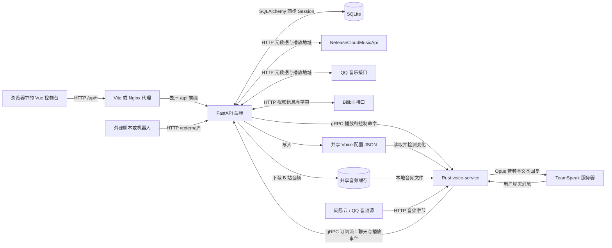
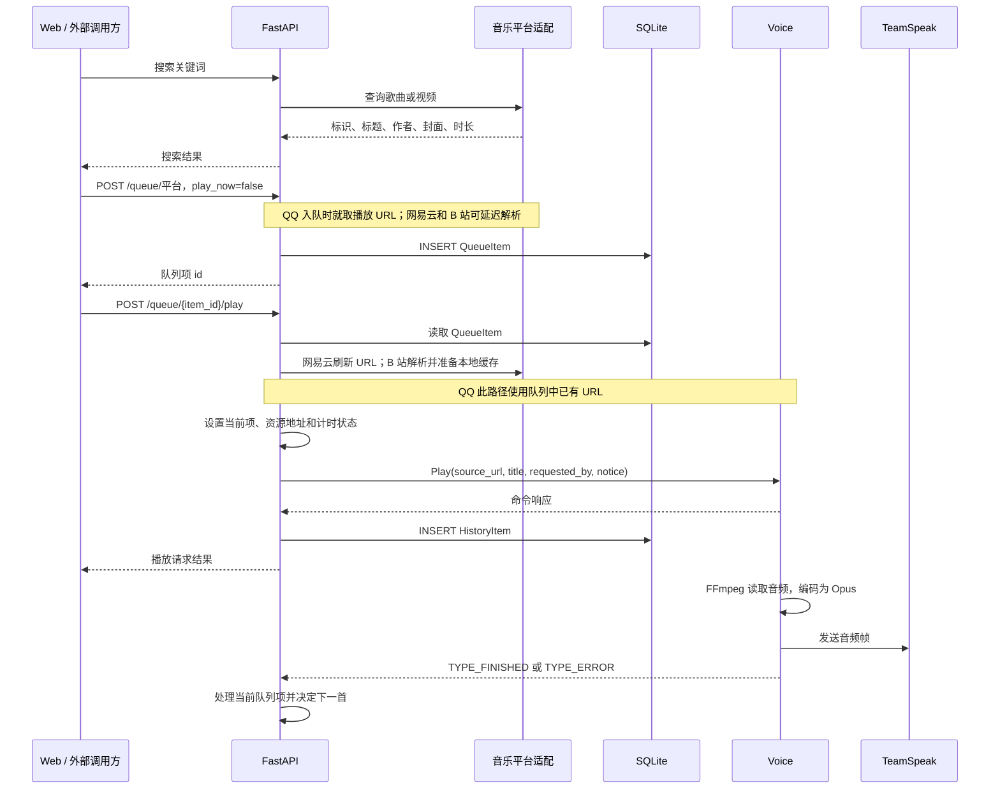
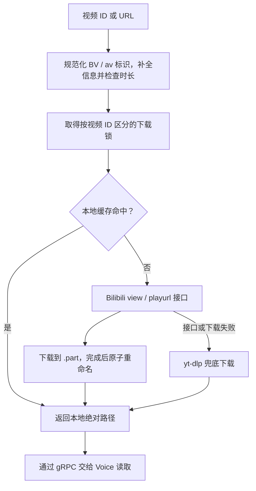
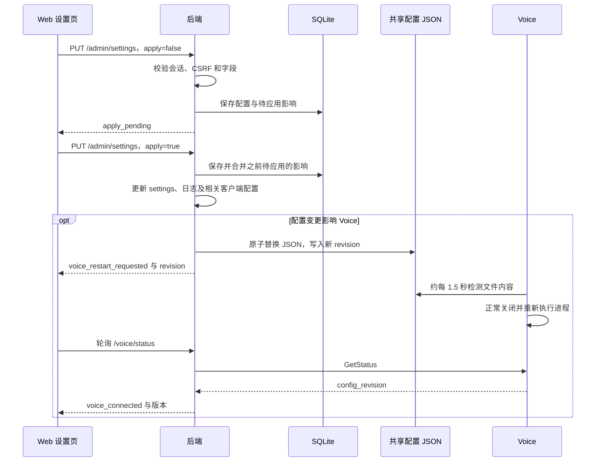

# TSBot 后端架构与数据流

本文面向首次阅读代码、接手维护或准备扩展功能的开发者，依据当前仓库实现整理。重点说明后端职责、数据流向、状态归属和部署约束；不是未来架构设计，也不代表已经完成真实音乐平台和 TeamSpeak 环境的联调验证。

相关文档：[项目说明](../README.md)、[部署指南](../HOWTOSTART.md)、[API 参考](API.md)、[日志说明](../LOGGING.md)。API 参考中部分鉴权描述仍沿用旧实现，当前边界见本文第 7 节；具体路由和字段同时参考运行实例的 `/docs`、`/openapi.json` 及对应代码。

## 1. 系统全貌

TSBot 是一套由 Web 控制台、Python 后端和 Rust 语音服务组成的 TeamSpeak 音乐机器人。后端是业务编排中心，负责搜索、平台授权、队列、历史、播放调度和配置；Voice 负责真正读取音频、解码、编码并发送到 TeamSpeak。



图中 HTTP 和 gRPC 控制请求通常还会返回响应。浏览器接收状态、歌词和队列 JSON，主要音频输出发生在 TeamSpeak。后端与 Voice 之间的 gRPC 传递地址、命令和事件，不传输整段音频。

三个进程可以分别启动，但目前依赖共享文件：B 站音频缓存、Voice 配置以及机器人头像。将后端和 Voice 分到不同机器时，单独打通 gRPC 还不够。

## 2. 后端内部如何组织

后端采用 FastAPI + SQLAlchemy + Pydantic + httpx。当前没有独立的 controller/service/repository 分层，大部分路由和业务编排集中在 [backend/main.py](../backend/main.py)，周边模块提供专项能力。

| 模块 | 实际职责 | 主要调用方或依赖 |
| --- | --- | --- |
| [main.py](../backend/main.py) | `app`、HTTP 路由、请求模型、队列调度、播放内存状态、聊天命令、B 站主体适配 | Web、外部 API、Voice 事件处理共用这里的函数 |
| [db.py](../backend/db.py) / [models.py](../backend/models.py) | 数据库引擎、同步 Session、建表、六个数据模型 | 路由使用 `Depends(get_session)`，内部任务使用 `new_session()` |
| [netease.py](../backend/netease.py) | 调用外部 `NeteaseCloudMusicApi` 的 HTTP 客户端 | 搜索、详情、URL、歌词、歌单、账号与二维码登录 |
| [qqmusic.py](../backend/qqmusic.py) | 直接访问 QQ 音乐接口，管理客户端 Cookie，解析播放地址和内容 | QQ 搜索、点播、歌词、歌单和登录接口 |
| [bilibili_auth.py](../backend/bilibili_auth.py) | B 站 Cookie、二维码登录、Playwright 页面环境与字幕补抓 | `main.py` 中 B 站授权和歌词流程 |
| [bilibili_cache.py](../backend/bilibili_cache.py) | 清理过期音频、残留下载和超容量缓存 | `main.py::_find_cached_bilibili_audio` |
| [auth.py](../backend/auth.py) | 管理员初始化、密码哈希、会话 Cookie、CSRF、首次改密限制 | `/auth/*` 和管理员路由 |
| [crypto.py](../backend/crypto.py) / [netease_cookie.py](../backend/netease_cookie.py) | Fernet 加解密；网易云有效登录 Cookie 提取与识别 | 平台授权和敏感配置读写 |
| [config.py](../backend/config.py) / [runtime_config.py](../backend/runtime_config.py) | 启动设置；运行配置定义、校验、持久化、应用和 Voice 配置输出 | 启动流程与 `/admin/settings` |
| [managed_assets.py](../backend/managed_assets.py) | 界面图标、机器人头像的固定路径、格式与大小校验、原子替换 | `/assets/*`、`/admin/assets/*`、Voice 配置生成 |
| [voice_client.py](../backend/voice_client.py) / [grpc_codegen.py](../backend/grpc_codegen.py) | 异步 gRPC 客户端、连接复用、事件订阅、按需生成 Python stub | 播放控制、状态查询和后台事件任务 |
| [logger.py](../backend/logger.py) / [admin_cli.py](../backend/admin_cli.py) | 日志配置与重配置；本地管理员密码重置入口 | 启动、设置应用、本地维护 |

`netease`、`qqmusic`、`voice` 在 `main.py` 中是进程级实例。`async def` 不意味着全链路都是异步：SQLAlchemy 使用同步引擎，部分 B 站 HTTP、下载和字幕处理通过 `asyncio.to_thread()` 放到线程执行。

### 启动和关闭

启动入口是 `uvicorn backend.main:app`。导入模块时建立应用、客户端对象和内存状态；FastAPI 的 `_startup()` 随后：

1. 调用 `create_db_and_tables()`，为缺失的表建表。
2. 初始化管理员；数据库没有相应运行配置时从环境或默认值导入，应用到 `settings`，写出共享 Voice 配置。
3. 更新网易云客户端地址，尝试恢复 `secrets.voice_volume` 中的音量。
4. 调度 TeamSpeak 简介更新，并启动 `_chat_command_worker()`，订阅聊天和播放事件。

Voice 暂时不可用不会阻止上述音量恢复之外的启动步骤继续执行，事件订阅会重试。关闭时取消事件任务、关闭 B 站扫码会话并关闭 gRPC channel。

`create_all()` 不是数据库版本迁移系统。仓库保留了 [migrate_history.py](../backend/migrate_history.py) 这一历史字段迁移脚本，但它使用固定数据库路径，也不在启动流程中自动执行。

## 3. HTTP 入口与调用链

默认浏览器请求 `/api/queue`，代理转成后端的 `/queue`。后端本身没有统一 `/api` 路由前缀。请求封装见 [web/src/api.ts](../web/src/api.ts)，代理见 [vite.config.ts](../web/vite.config.ts) 和 [nginx-web.conf](../docker/nginx-web.conf)。

| 入口组 | 代表路径 | 下游处理 |
| --- | --- | --- |
| 搜索与平台内容 | `/search`、`/netease/*`、`/qqmusic/*`、`/bilibili/search/videos` | 平台客户端或 `main.py` 的 B 站适配 |
| 队列 | `/queue`、`/queue/netease`、`/queue/qqmusic`、`/queue/bilibili`、`/queue/{item_id}/play` | `QueueItem`、`_enqueue_*`、`_play_queue_item_internal` |
| 播放控制 | `/voice/status`、`/voice/play`、`/voice/pause`、`/voice/next`、`/voice/seek`、`/voice/fx` | 后端状态与 `VoiceClient` |
| 历史与歌词 | `/history`、`/history/{history_id}/replay`、`/lyrics/{queue_item_id}` | `HistoryItem`、重新入队、按平台取歌词或字幕 |
| 稳定外部集成 | `/external/search`、`/external/queue`、`/external/status`、`/external/player/*`、`/external/history` | 统一参数与结果，复用内部入队和播放控制逻辑 |
| 管理与授权 | `/auth/*`、`/admin/settings`、`/admin/cookie`、`/admin/qqmusic/*`、`/admin/bilibili/*` | 认证、加密存储、配置应用 |
| 品牌与图片 | `/config/public`、`/assets/{asset_key}`、`/admin/assets/{asset_key}` | 品牌配置和受管文件 |

三类业务入口是 Web HTTP、外部 HTTP、TeamSpeak 聊天。聊天命令通过 gRPC 事件进入 Python，直接调用内部函数，不会再向本机发送 HTTP 请求。外部集成优先使用 `/external/*`；普通平台接口有些保留上游结构，例如 `/search` 返回 `raw`，不能把所有搜索响应当成统一格式。

## 4. 主要数据流

### 4.1 搜索、排队、播放

下面以“先加入队列，再播放指定队列项”为例。`play_now=true` 的各平台入队函数也能直接发起播放，不能假设所有立即播放都经过 `_play_queue_item_internal()`。



时序图中的音频处理是 Voice 中的异步任务，可能与后端写历史并行。历史在 `voice.play()` 返回后写入，不等整首结束，也不证明用户已经听到声音。只入队不会写历史；数据库提交与 gRPC 播放命令之间没有跨进程事务。

三个平台的关键差异如下：

| 平台 | `play_now=false` 时 | 播放已有队列项时 | 音频字节的流向 |
| --- | --- | --- | --- |
| 网易云 | 存歌曲 ID、元数据与音质标记，暂不取 URL | 读取管理员 Cookie，按音质重新解析播放 URL，必要时尝试试听地址 | 音频源 → Voice 的 FFmpeg |
| QQ 音乐 | 读取管理员 Cookie，入队时就解析并保存 URL | 当前通用播放函数直接用已存 URL，不重新解析 | 音频源 → Voice 的 FFmpeg |
| Bilibili | 存视频 ID、元数据，`source_url` 可以为空 | 补全信息、检查时长，查缓存或下载后取得本地绝对路径 | B 站音频源 → 后端磁盘缓存 → Voice 的 FFmpeg |

平台队列接口及 `/external/queue` 默认 `play_now=false`，只是排队。聊天中的歌单选择等特定流程会额外判断空闲状态并启动播放。网易云与 QQ 的实际点播路径会读取数据库中的管理员授权，浏览器自己的网易云登录态不自动替代它。

### 4.2 B 站音频和字幕

音频流程位于 `main.py::_resolve_bilibili_playback_payload()`：



缓存位于仓库的 `tmp/bilibili_audio/`。默认保留 72 小时、容量 2048 MiB，未完成下载保留 60 分钟；清理在缓存查找时触发，不是独立定时任务。容量淘汰参考文件修改时间，命中会更新该时间，当前请求文件会获得容量淘汰保护。过期规则和容量规则是不同阶段，不能把容量保护理解为永久保留。时长和缓存限制由 Web 运行配置管理。

歌词请求 `/lyrics/{queue_item_id}` 先从队列项识别平台：网易云与 QQ 的 LRC 转成 `{time, text}` 列表；B 站按“公开字幕接口 → 管理员登录态接口 → Playwright 页面补抓”的顺序尝试，最后仍可能返回空列表。字幕缓存在后端内存中，默认 30 分钟，缓存键包含视频、语言偏好和登录态摘要。Playwright/Chromium 用于扫码和字幕补抓，音频解码由 Voice 的 FFmpeg 完成。

### 4.3 播放完成、切歌与进度刷新

Voice 的 `SubscribeEvents` 是后端主动建立的服务端流。`_chat_command_worker()` 在同一个消费循环中处理聊天与播放事件；断流时按 1、2、4 秒递增重连，最高等待 30 秒。事件来自 Voice 进程内的广播通道，没有持久化事件日志或断线补发机制。

| 事件或操作 | 后端行为 |
| --- | --- |
| 自然结束，`repeat_mode=one` | 匹配当前资源地址后重播原队列项，保留该项 |
| 自然结束，其他循环模式 | 匹配当前资源地址，清除当前状态，删除完成项，选择下一首 |
| `TYPE_ERROR` | 匹配后删除失败项，尝试发送聊天提示并播放下一首 |
| `/voice/next` 或 `/voice/skip` | 处理当前或待播项，作废旧播放请求，推进队列；具体分支还受随机模式影响 |
| `DELETE /queue` | 清空数据库队列、随机序列和当前状态，作废待处理播放请求，尝试停止 Voice |
| `DELETE /queue/{item_id}` | 删除队列记录并调整随机序列；该路由本身不发送停止命令 |

自然结束通过 `_take_now_playing_if_match(source_url=...)` 判断事件是否属于当前资源，避免旧资源事件影响已经切换的曲目。`_play_request_generation` 是另一道保护：已有队列项播放和 B 站立即播放会在异步解析后检查请求是否过期，清空或跳过时可使旧请求失效。这是阻止旧结果生效，不意味着已开始的线程下载会立即停止。

随机模式的顺序存于内存 `_shuffle_queue`，普通模式按 `QueueItem.id` 升序选择。当前 `repeat_mode=all` 允许选择时绕回队列头，但自然完成仍会删除曲目，因此不能理解为保留整张列表并无限循环。`previous` 也主要查找仍在队列中的前一项，历史重播是另一条路径。

Web 的 [MusicPlayer.vue](../web/src/components/MusicPlayer.vue) 轮询 `/voice/status`，根据状态以约 1～3 秒间隔调整，异常时可放缓到 5 秒。这里没有 WebSocket/SSE 播放状态推送。后端把 Voice 的状态、音量和配置版本，与自己的队列 ID、元数据、暂停/跳转计时合并后返回。

`current_time` 是后端用单调时钟估算的秒数，不是 Voice 上报的实际解码位置。gRPC `StatusResponse` 没有播放位置字段。`voice_connected` 只说明后端能否查询 Voice gRPC 状态，不等价于 TeamSpeak 已进频道或音频已送达；后端没有当前队列项时还会把对外 `state` 归为 `idle`。

### 4.4 TeamSpeak 聊天点播

```text
TeamSpeak 用户消息
  → Rust ts3_actor 接收并发布 ChatEvent
  → SubscribeEvents 流
  → Python _chat_command_worker
  → _handle_chat_command 解析中英文别名和参数
  → 搜索 / _enqueue_* / 播放控制 / 队列操作
  → VoiceClient.send_notice
  → Rust 发送 TeamSpeak 文本回复
```

命令中的歌曲搜索和歌单搜索主要走网易云。歌单搜索返回前 5 个结果，按用户唯一 ID（缺失时回退到昵称）隔离，保留 5 分钟；`select/选择` 从该用户最近结果中选歌单，逐曲入队，空闲时尝试启动播放。重启后这些临时搜索结果消失。

队列变化还会调度 `_ts_desc_worker()`，合并客户端简介更新，展示当前歌曲和队列预览。Voice 的主客户端连接负责 TeamSpeak 通信；可选 legacy ServerQuery 是更新简介的辅助路径，不是主要音频链路。

### 4.5 历史重播

`/history/{history_id}/replay` 和对应外部接口读取 `HistoryItem`，交给 `_replay_history_item()` 根据 `track_id` 前缀重新走平台入队函数。历史是歌曲信息快照，不是指向原队列项的外键。重播会创建新的队列项，立即播放时还会产生新的历史记录；平台重新解析或缓存逻辑决定最终资源地址。

## 5. 数据模型与状态归属

### 数据库

默认数据库由 `DATABASE_URL`、`TSBOT_DATABASE_URL`、`sqlite:///./tsbot.db` 按顺序选择。当前引擎连接参数含 SQLite 专用的 `check_same_thread=False`，不能仅凭使用 SQLAlchemy 就认定切换到其他数据库已经得到支持。

| 表 / 模型 | 主要字段 | 用途 |
| --- | --- | --- |
| `queue_items` / `QueueItem` | `id`、`track_id`、标题/作者/专辑、`duration`、`cover_url`、`source_url`、`created_at` | 等待或正在播放的条目；没有单独的排序位置或播放状态列 |
| `history_items` / `HistoryItem` | 歌曲字段快照、`played_at`、`requested_by` | 记录播放请求，供最近播放和重播使用 |
| `secrets` / `Secret` | `key`、`value` | 平台 Cookie 的加密值；也保存 `voice_volume` 等普通值，不能认为全表都加密 |
| `app_settings` / `AppSetting` | `key`、`value`、`updated_at` | 运行配置、待应用影响标记；敏感字段加密，普通字段为 JSON 文本 |
| `admin_credentials` / `AdminCredential` | 用户名、密码哈希、首次改密标志、密码版本 | 当前单管理员模型，常用记录 ID 为 1 |
| `admin_sessions` / `AdminSession` | 会话 Token 哈希、CSRF Token、密码版本、有效期 | 服务端管理员会话校验 |

这六个模型没有声明表间外键关系。队列和历史通过同样的 `track_id` 约定识别歌曲，历史不会随队列项删除而删除。`GET /history` 默认只取最近 200 条，这是查询限制，不是数据库自动清理策略。

### 标识和时间单位

| 字段或值 | 含义 |
| --- | --- |
| `QueueItem.id`、`queue_id`、路由中的 `item_id` | 本次入队记录的整数主键，同一歌曲可以有多个队列项 |
| `QueueItem.track_id` / `HistoryItem.track_id` | `netease:<song_id>`、`qqmusic:<song_mid>`、`bilibili:<video_id>` 等来源标识 |
| `/voice/status` 返回的 `track_id` | 当前队列项整数 ID；名称与上面的字符串 `track_id` 容易混淆 |
| 数据库 `duration`、入队参数 `duration_ms` | 毫秒 |
| 队列/历史响应 `duration`、状态 `current_time`/`duration`、歌词 `time`、seek `time` | 秒 |
| `source_url` | 可能是远程音频 URL、本地绝对路径、空值或网易云音质元数据；不能统一当成可直接播放的 HTTP URL |

网易云用 `__netease_level__:` 标记在队列 `source_url` 中保存音质信息；API 序列化和实际播放会剥离该元数据。跨平台扩展或修改响应格式时，应一起检查入队、队列播放、序列化、歌词和历史重播。

### 哪些状态能跨重启保留

| 位置 | 保存的数据 | 重启或换设备后的含义 |
| --- | --- | --- |
| SQLite | 队列、历史、管理员、会话、运行配置、平台授权、音量记录 | 保留数据库和加密密钥时可继续读取；会话仍受过期时间和密码版本限制 |
| 后端进程内存 | 当前/待播 ID、当前资源、计时、随机顺序、循环模式、聊天临时结果、B 站摘要/字幕缓存 | 后端重启后重置；启动函数没有恢复当前曲目并自动续播的步骤 |
| Voice 进程内存 | 活跃播放任务、暂停控制、TeamSpeak 连接、事件广播 | Voice 重启后重新建立，当前曲目不会从状态文件自动恢复 |
| `logs/voice_state.json`，可配置 | 音量、声道与音效参数 | Voice 启动时加载，不保存完整队列或播放进度 |
| `tmp/bilibili_audio/` | 已下载音频和未完成下载 | 文件存在且未被清理时可复用；数据库中的路径不保证文件一直存在 |
| 受管图片目录 | 界面图标和机器人头像 | 默认按显式 SQLite 配置定位到数据库旁 `uploads/`；未指定数据库时回退 `data/uploads/`，也支持 `TSBOT_ASSET_DIR` |
| 浏览器 `localStorage` | 本地收藏、网易云用户 Cookie、部分页面缓存等 | 属于当前浏览器和站点，不是后端账号云同步数据 |

浏览器本地收藏实现见 [favorites.ts](../web/src/utils/favorites.ts)。网易云个人登录与后端管理员播放授权是两条数据流：个人 Cookie 随相关请求以 `x-netease-cookie` 提供，管理员 Cookie 则从数据库解密后供服务器点播使用。

## 6. 配置保存与运行时应用

启动参数决定进程如何运行，例如监听地址、数据库、`TSBOT_COOKIE_KEY` 和共享配置文件路径。仓库脚本读取根目录 `tsbot.env`；`config.py` 自身配置的 dotenv 路径是 `backend/.env`，直接手动启动 Uvicorn 时要确保所需环境变量已注入。

运行配置以 `runtime_config.py::DEFINITIONS` 为字段目录，包含类型、校验范围、是否敏感、界面分组和影响范围。数据库已有值优先使用；初始化导入不是每次启动都用环境覆盖数据库。



设置页等待版本匹配，默认最多 60 秒。机器人头像更换/清除也会触发 Voice 配置版本变化。后端通过共享文件促使 Voice 自行重启，不依赖 Docker Socket 或远程进程管理接口。

`apply=false` 表示本次不更新正在运行的服务；如果之后重启后端，启动流程仍会加载已保存的配置并清除待应用标记。数据库提交与文件写入/Voice 重启也不是一个原子事务，保存成功和 Voice 恢复成功是两个阶段。

## 7. 认证、授权与信任边界

以下描述对应当前代码，尤其是 `main.py::_path_requires_api_token()`、`auth.py` 和具体路由；不要用旧的 `x-admin-token` 文档推断现状。

| 边界 | 当前实现 |
| --- | --- |
| 管理员登录 | PBKDF2-SHA256 加盐密码哈希；初始密码首次生成并要求改密；登录失败按来源地址进行进程内退避 |
| 管理会话 | `tsbot_admin_session` HttpOnly、SameSite=Strict Cookie；HTTPS 时设置 Secure；数据库保存 Token 哈希，默认有效期 7 天 |
| 管理接口写操作 | 会话、首次改密状态和 CSRF 校验；前端通过 `X-CSRF-Token` 提交会话对应 Token |
| 外部集成 | 配置 API Token 后仅 `/external` 和 `/external/*` 由 Token 中间件保护，支持 Bearer 或 `x-api-token`；没有配置时不会强制 Token |
| 普通点歌和播放 API | `/queue`、`/voice/*` 等普通路由不因配置外部 Token 自动获得管理员保护；管理员登录也不是整站所有操作的统一门禁 |
| 平台凭据 | 平台管理员 Cookie 与敏感运行字段经 Fernet 加密入库，依赖 `TSBOT_COOKIE_KEY` 解密；旧 `TSBOT_ADMIN_TOKEN` 仅可用于首次管理员初始化兼容 |
| 图片上传 | 固定资源键与路径，检查文件签名和 5 MiB 上限；前端原始文件体上传，不接受任意服务器目标路径 |
| Voice gRPC | Python 使用 `grpc.aio.insecure_channel`，当前 Rust 服务未配置 gRPC TLS/应用鉴权；网络访问控制属于部署边界 |

数据库加密不覆盖整个运行链路：共享 Voice JSON 含解密后的连接参数，写入权限设为 `0600`；日志也不能视为天然脱敏，首次密码会写日志，QQ 客户端中还存在 Cookie 调试输出。备份、诊断和分享日志时需要按这些实际数据位置处理。

通用 `POST /queue` 接受调用方提供的 `source_url`，Voice 最终交给 FFmpeg 读取。因此谁能访问点播接口，也关系到谁能影响 Voice 读取的资源。部署时应按这些现有边界决定代理和网络可访问范围，不能把配置外部 API Token 等同于保护了所有入口。

## 8. 部署与排障时最有用的信息

### 进程、端口和共享目录

| 组件 | 常见启动入口 | 默认端口或用途 |
| --- | --- | --- |
| 后端 | [run-backend.sh](../run-backend.sh)，`backend.main:app` | `8009`，HTTP API 和 `/docs` |
| Voice | [run-voicemake.sh](../run-voicemake.sh)，Rust `main.rs` | `50051`，gRPC；运行环境还需要 FFmpeg |
| Web | [run-web.sh](../run-web.sh) 或 Vite dev | 生产/preview `8080`，开发 `5173` |
| 网易云适配服务 | 独立部署的 NeteaseCloudMusicApi | 地址在音乐接口配置中设置；QQ 和 B 站无需类似独立 API 服务 |

[docker-compose.yml](../docker-compose.yml) 中后端通过 `voice-service:50051` 连接 Voice，通过 `backend:8009` 接收 Web 代理请求。后端和 Voice 同时挂载 `/app/logs`、`/app/data`、`/app/tmp`，分别用于配置/状态、数据库/图片、B 站缓存等。

本地绝对路径必须在 Voice 侧指向同一文件，配置与头像也需要可见。数据库恢复时应同时保留 `TSBOT_COOKIE_KEY`；Voice identity 文件决定机器人身份，也属于恢复部署时应保留的数据。音频缓存可以重新下载，浏览器收藏不会包含在后端数据库备份里。

### 当前运行约束

- 按“一个后端进程协调一个 Voice 播放器”理解当前部署。增加 Uvicorn workers 会产生多份当前播放状态和多条事件消费者；共享 SQLite 不会同步这些内存变量，因此不能直接当作无状态服务横向扩容。
- gRPC 事件流没有历史重放；聊天处理与播放事件处理共用消费循环，耗时命令会延后后续事件处理。重连成功不保证补收到断线期间的完成事件。
- 普通队列排序依赖主键；前端 `PlaylistView.vue` 存在 `/queue/reorder` 调用，但当前后端没有对应路由，也没有排序字段，不应把拖拽持久化视为已完成能力。
- 已排队 QQ URL 可能随时间失效，因为播放已有队列项时不重新解析。排查时区分“重新入队/历史重播”和“播放旧队列项”。
- 仓库有旧 C++ 语音源码，常用脚本、Make 与 Docker 主路径使用 Rust。阅读默认音频实现时从 `voice-service/src/main.rs` 开始。

### 按症状定位

| 现象 | 优先检查 |
| --- | --- |
| Web 能打开但 API 404 | `/api` 前缀是否被代理移除；代理目标端口与后端路由是否一致 |
| 搜索正常但无法播放 | 平台管理员授权、URL 解析，再检查 Voice gRPC、FFmpeg 和 TeamSpeak 连接；搜索成功不证明完整播放链路成功 |
| B 站下载成功但 Voice 播放失败 | `source_url` 是本地路径，核对 Voice 容器/进程是否能读同一路径 |
| 当前曲目结束却没有下一首 | Voice 是否发出完成事件、订阅是否断开、资源地址是否匹配、后端当前项是否因重启丢失 |
| 设置已保存但行为未变化 | 是否执行“应用配置”、是否还有待应用标记、Voice 配置文件是否共享、版本是否匹配 |
| 历史里有记录但没有声音 | 历史在播放命令返回后写入；继续查 Voice 播放错误、FFmpeg 和 TeamSpeak 音频输出 |
| `/voice/status` 可用但听不到声音 | `voice_connected` 是 gRPC 可达性；查看 Voice 的 TeamSpeak 连接及音频日志 |
| 歌词为空或 B 站没有 AI 字幕 | 先确认曲目有字幕，再查管理员 B 站 Cookie、Playwright 浏览器环境和后端字幕日志 |

后端日志关注平台解析、事件订阅重连和命令异常；Voice 日志关注 TeamSpeak 连接、FFmpeg 输入与播放错误。日志路径和查看方式见 [LOGGING.md](../LOGGING.md)。

## 9. 建议的代码阅读与修改顺序

1. 读 `models.py` 和 `proto/voice.proto`：先明确持久化字段以及跨进程传递的内容。
2. 从 `main.py::add_queue_netease` / `add_queue_qqmusic` / `add_queue_bilibili` 跟进 `_enqueue_*`，再读 `_play_queue_item_internal`，理解排队与立即播放的区别。
3. 读 `_chat_command_worker` → `_handle_playback_finished` → `_auto_play_next_from_queue`，理解自动续播、删除和循环语义。
4. 读 `voice_client.py` → Rust `start_playback_internal` → `playback_loop` → `ts3_actor`，理解控制与实际音频输出如何衔接。
5. 读 `auth.py`、`runtime_config.py`、`admin_update_settings` 与 Web `SettingsView.vue`，理解授权和配置生效过程。
6. 最后对照 Web `api.ts`、`MusicPlayer.vue` 和搜索/队列页面，检查 UI 字段、单位与刷新策略。

后端现有测试集中在 [test_backend_regressions.py](../tests/test_backend_regressions.py) 和 [test_admin_configuration.py](../tests/test_admin_configuration.py)，覆盖缓存淘汰、Cookie 有效性、聊天歌单隔离、播放结束处理、Voice 离线状态、管理员认证、配置保存/应用和图片校验。它们以内存数据库、临时目录和 mock 为主，不替代真实音乐源和 TeamSpeak 联调。

在仓库根目录按改动范围选择检查：

```bash
# 后端回归
backend/.venv/bin/python -m unittest discover -s tests

# 修改了前端时
npm --prefix web run build

# 修改了 Voice 或共享协议时
cargo test --manifest-path voice-service/Cargo.toml
cargo fmt --manifest-path voice-service/Cargo.toml --check
```

协议修改要同步核对 Python 与 Rust：Python 在首次建立 gRPC stub 时按需生成到 `backend/_generated/`，Rust 由 [build.rs](../voice-service/build.rs) 在 Cargo 构建时生成。业务代码、协议源文件和测试应一起核对，生成目录及构建产物不手工编辑或提交。
