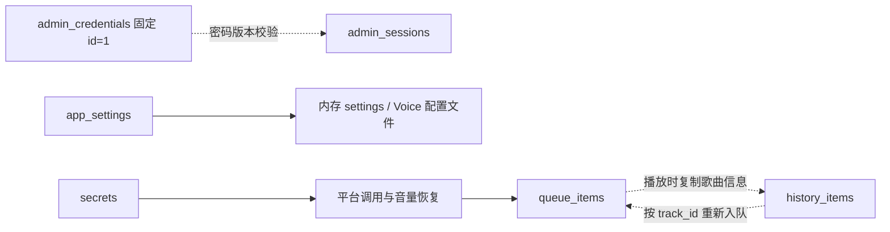
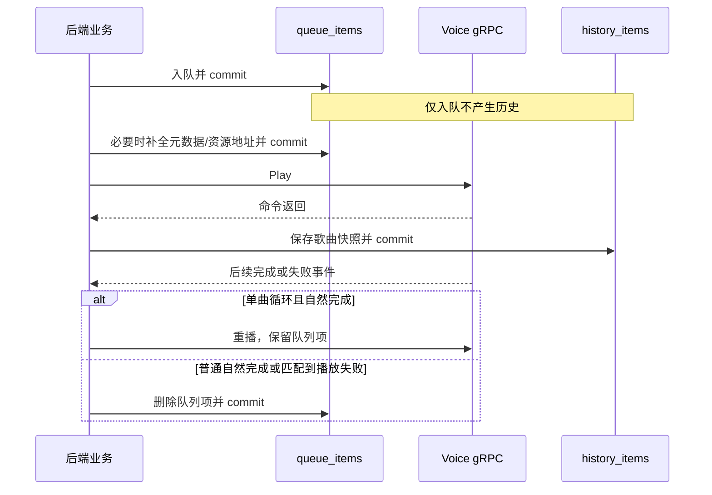

# TSBot 数据库结构分析

本文依据当前 [models.py](../backend/models.py)、[db.py](../backend/db.py) 及数据库读写调用链整理，描述代码期望的数据库结构，未读取部署数据库中的业务记录或凭据。旧数据库可能与模型不同，尤其是经历过手工迁移的实例。整体业务流程可结合 [后端架构与数据流](BACKEND_ARCHITECTURE.md) 阅读。

## 1. 数据库定位与连接方式

项目使用 SQLAlchemy 2 的声明式 ORM，当前默认数据库为 SQLite。数据库承担三个职责：保存队列和播放历史、保存管理员与会话、保存运行配置和平台授权。它不存储音频文件，也不保存完整的实时播放器状态。

| 项目 | 当前实现 |
| --- | --- |
| 连接地址优先级 | `DATABASE_URL` → `TSBOT_DATABASE_URL` → `sqlite:///./tsbot.db` |
| 本地默认位置 | `./tsbot.db`，相对后端进程工作目录；仓库启动脚本会先切换到仓库根目录 |
| Docker Compose | `sqlite:///./data/tsbot.db`，容器内 `/app/data/tsbot.db`，通过 `./data` 挂载持久化 |
| 引擎 | 模块导入时创建同步 `Engine`，连接参数包含 `check_same_thread=False` |
| Session | 同步 `Session`，`autocommit=False`、`autoflush=False`，业务函数显式 `commit()` |
| HTTP 请求 | `Depends(get_session)` 提供 Session，请求结束后关闭 |
| 内部任务 | `new_session()` 创建，通常由 `try/finally` 关闭 |
| 初始化 | FastAPI `_startup()` 调用 `Base.metadata.create_all()` |
| 版本迁移 | 无迁移版本表或 Alembic 流程；另有固定路径的历史表补列脚本 |

`async def` 路由中仍有同步数据库操作。`check_same_thread=False` 允许 SQLite 连接跨线程使用，但不把 Session 变成可任意并发共享的对象，也不提供多个后端进程之间的播放状态同步。当前连接参数针对 SQLite，不能仅修改 URL 就假定已支持其他数据库。

## 2. 六张表及逻辑关系

| 表名 | ORM 模型 | 职责 | 主键 |
| --- | --- | --- | --- |
| `queue_items` | `QueueItem` | 待播或正在播放的队列项 | `id` |
| `history_items` | `HistoryItem` | 发起播放时记录的歌曲快照 | `id` |
| `admin_credentials` | `AdminCredential` | 管理员账号与密码状态 | `id` |
| `admin_sessions` | `AdminSession` | 管理员登录会话 | `id` |
| `app_settings` | `AppSetting` | 普通/敏感运行配置和待应用标记 | `key` |
| `secrets` | `Secret` | 平台管理员 Cookie 和音量等键值数据 | `key` |

六张表均没有声明 `ForeignKey` 或 ORM `relationship()`。下面的线表示业务代码建立的联系，不是数据库外键：



同一首歌可多次入队、多次生成历史。同一 `track_id` 不代表同一条队列记录，也不能通过它唯一关联一条历史。管理员逻辑使用固定 `id=1`，会话表没有 `admin_id`；这是单管理员设计，不是已实现的多用户权限模型。

## 3. 完整字段字典

下表类型对应 ORM 声明。除两张歌曲表的 `duration` 外，其余字段均按模型声明为非空。`—` 表示没有声明默认值。

“默认值”列中的 `default=` 和 `onupdate=` 都是 SQLAlchemy 客户端行为；当前模型没有声明 `server_default` 或数据库更新触发器。原始 SQL 写入不能依赖这些 Python 默认值自动补齐，直接 SQL 更新也不会自动更新 `updated_at`。

### 3.1 `queue_items`：播放队列

| 字段 | 类型 | 可空 | 默认值 / 生成方式 | 说明 |
| --- | --- | --- | --- | --- |
| `id` | `Integer` | 否 | SQLite 整数主键生成 | 一次入队的标识，普通队列按它升序排列 |
| `created_at` | `DateTime` | 否 | `beijing_now()` | 入队时间，有普通索引 |
| `track_id` | `String(64)` | 否 | — | 平台与歌曲标识，有普通索引，但不唯一 |
| `title` | `String(255)` | 否 | — | 歌曲或视频标题 |
| `artist` | `String(255)` | 否 | `""` | 歌手或视频作者 |
| `album` | `String(255)` | 否 | `""` | 专辑或平台适配提供的分类信息 |
| `duration` | `Integer` | 是 | — | 时长，单位毫秒；未知时可为 `NULL`，QQ 入队路径也可能写 `0` |
| `cover_url` | `Text` | 否 | `""` | 封面 URL；常用 API 序列化为 `artwork` |
| `source_url` | `Text` | 否 | — | 播放 URL、本地路径、网易云音质编码或空字符串 |

没有 `position`、`status`、`requested_by`、`user_id` 字段。当前播放项、随机顺序与待播状态由后端内存维护。原始点歌人没有保存在队列里，后续自动播放写历史时通常使用当次调用的 `requested_by="auto"`，不能从队列追溯最初点歌人。

`track_id` 的主流约定是 `netease:<song_id>`、`qqmusic:<song_mid>`、`bilibili:<video_id>`。通用 `POST /queue` 还能接受调用方提供的值；数据库没有来源枚举或格式约束。

`source_url` 随来源和阶段变化：

| 来源 | 仅入队 | 播放已有队列项 |
| --- | --- | --- |
| 网易云 | `auto` 可为空；指定音质保存 `__netease_level__:<level>` | 重新解析 URL，必要时保存 `__netease_level__:<level>\|<url>` |
| QQ 音乐 | 入队前已取 URL，直接保存远程地址 | 当前播放函数复用已存 URL，不刷新 |
| Bilibili | 可以为空 | 下载或复用缓存，保存本地绝对路径 |
| 通用入队 | 保存请求中的 `source_url` | 非网易云/B站专用分支直接使用已有值 |

非空字段允许空字符串。因此，“`source_url IS NOT NULL`”并不表示已经准备好播放资源。网易云队列序列化会剥离音质标记，外部查询结果与数据库原文可能不同。

### 3.2 `history_items`：播放历史

| 字段 | 类型 | 可空 | 默认值 / 生成方式 | 说明 |
| --- | --- | --- | --- | --- |
| `id` | `Integer` | 否 | SQLite 整数主键生成 | 历史记录主键，查询默认倒序 |
| `played_at` | `DateTime` | 否 | `beijing_now()` | 创建历史记录的时间，有普通索引 |
| `track_id` | `String(64)` | 否 | — | 来源标识，有普通索引，但不唯一 |
| `title` | `String(255)` | 否 | — | 播放时的标题快照 |
| `artist` | `String(255)` | 否 | `""` | 作者快照 |
| `album` | `String(255)` | 否 | `""` | 专辑/分类快照 |
| `duration` | `Integer` | 是 | — | 毫秒，与队列表采用相同单位 |
| `cover_url` | `Text` | 否 | `""` | 封面 URL 快照 |
| `source_url` | `Text` | 否 | — | 当次提交给 Voice 的资源地址 |
| `requested_by` | `String(64)` | 否 | `""` | 本次播放调用的来源或名称，如 `web`、`auto`、`web_history`、聊天用户昵称 |

历史记录在 `voice.play()` 返回之后写入，不等待播放结束。它不包含播放结果、失败原因、实际听完时长或完成时间，因此不能直接用作“成功播放统计”。只排队不创建历史；单曲循环每次重新发起播放可再写一条记录。

历史没有 `queue_item_id` 外键，删除队列项不会删除历史。历史重播按 `track_id` 调用平台入队流程，创建新队列项，而不是依赖历史 URL 永久有效。数据库重复保存歌曲字段是快照设计：原队列消失后仍能展示最近播放。

### 3.3 `admin_credentials`：管理员凭据

| 字段 | 类型 | 可空 | 默认值 | 说明 |
| --- | --- | --- | --- | --- |
| `id` | `Integer` | 否 | `1` | 主键；业务按 ID 1 查找管理员 |
| `username` | `String(64)` | 否 | `"admin"` | 唯一约束 |
| `password_hash` | `Text` | 否 | — | 加盐 PBKDF2-SHA256 编码字符串 |
| `must_change_password` | `Boolean` | 否 | `True` | 首次登录或本地重置后要求改密 |
| `password_version` | `Integer` | 否 | `1` | 改密时递增，用于使旧会话失效 |
| `created_at` | `DateTime` | 否 | `beijing_now()` | 初始化时间 |
| `updated_at` | `DateTime` | 否 | `beijing_now()` | ORM 更新时也通过 `onupdate` 刷新 |

密码存储格式为 `pbkdf2_sha256$迭代次数$盐的十六进制$摘要的十六进制`，当前迭代次数为 600,000。它是不可逆的密码哈希，不使用平台 Cookie 的 Fernet 加密方式。

首次启动在 ID 1 不存在时创建管理员。数据库没有 `CHECK(id = 1)`，所以“只有一个管理员”是业务约定，不是数据库强制限制。手工添加其他 ID 的账号不会自动获得登录支持。

### 3.4 `admin_sessions`：管理员会话

| 字段 | 类型 | 可空 | 默认值 / 生成方式 | 说明 |
| --- | --- | --- | --- | --- |
| `id` | `Integer` | 否 | `secrets.randbits(62) + 1` | 随机正整数主键，由 Python 生成 |
| `token_hash` | `String(64)` | 否 | — | 原始会话 Token 的 SHA-256 十六进制摘要，唯一索引 |
| `csrf_token` | `String(64)` | 否 | 创建会话时提供 | CSRF 随机 Token，明文保存并返回给已认证前端 |
| `password_version` | `Integer` | 否 | 创建会话时提供 | 创建会话时管理员的密码版本快照 |
| `created_at` | `DateTime` | 否 | `beijing_now()` | 会话创建时间 |
| `expires_at` | `DateTime` | 否 | 创建会话时提供 | `auth._now() + 7 天`，有普通索引 |

原始会话 Token 在创建时生成并放进 HttpOnly Cookie，数据库不存原文。每次认证按 `token_hash` 找会话，并同时检查固定管理员是否存在、有效期是否已过、密码版本是否一致。

正常注销删除当前会话；改密和本地密码重置会删除全部会话。发现当前请求对应会话已过期或版本不符时会删除该条记录，但没有扫描清理全部过期会话的定时任务。未再使用的过期记录可能继续存在。

`expires_at` 的生成使用服务器本地无时区 `datetime.now()`，而 `created_at` 默认使用北京时间函数，不能直接假定两者天然采用同一时区，详见第 7 节。

### 3.5 `app_settings`：运行配置

| 字段 | 类型 | 可空 | 默认值 | 说明 |
| --- | --- | --- | --- | --- |
| `key` | `String(128)` | 否 | — | 配置主键，如 `web.app_name`、`voice.ts3_port` |
| `value` | `Text` | 否 | — | 普通字段是 JSON 文本，敏感字段是 JSON 文本经 Fernet 加密后的字符串 |
| `updated_at` | `DateTime` | 否 | `beijing_now()` | ORM 更新时通过 `onupdate` 刷新 |

字段目录在 [runtime_config.py](../backend/runtime_config.py) 的 `DEFINITIONS`，数据库仅保存键值，不存字段类型、校验范围、界面标签或重启策略。这些规则由代码提供。

| 配置类别 | 代表键 | 存储含义 |
| --- | --- | --- |
| Web | `web.app_name`、`web.log_level` | JSON 字符串 |
| 后端/音乐源 | `backend.netease_api_base`、`backend.voice_grpc_addr`、`backend.log_level`、`backend.log_file` | JSON 字符串 |
| B 站限制 | `backend.bilibili_max_duration_minutes`、`backend.bilibili_audio_cache_max_mb` 等 | JSON 整数 |
| 外部 API | `backend.api_tokens` | 敏感字段，加密存储 |
| Voice/TeamSpeak | `voice.ts3_host`、`voice.ts3_port`、`voice.allow_direct_description`、`voice.state_file` 等 | JSON 字符串、整数或布尔值 |
| TeamSpeak 敏感项 | `voice.ts3_server_password`、`voice.ts3_channel_password`、`voice.ts3_identity`、`voice.serverquery_password` | 敏感字段，加密存储 |
| 内部待应用标记 | `__runtime.pending_effects` | JSON 数组，保存 `none`、`voice`、`backend` 中的影响分类 |

非敏感字符串也经过 JSON 编码，例如界面名称的数据库值是 `"示例机器人"`（包含 JSON 引号），布尔值是 `true`/`false`，并非 Python 的 `True`/`False`。该表没有 JSON 类型约束，直接 SQL 写入不合法 JSON 会使应用读取失败。

配置语义需要注意：

- 初始化只导入缺失的配置项；缺失且为空的敏感项可不建立行，已有值不被环境变量覆盖。
- `apply=false` 直接更新配置行并记录待应用影响，没有另一套“草稿值表”或“已应用值表”。运行中旧值暂留在内存/Voice 文件里。
- `apply=true` 合并之前保存的影响，提交数据库后再更新运行状态，必要时写 Voice 配置文件。
- 敏感字段提交空字符串表示“保持原值”；提交 `null` 会存入加密空字符串，明确覆盖旧值或环境种子。普通字段提交 `null` 则删除配置行，后续读取回退到环境或默认值。
- 后端重启会加载已保存配置，并清除待应用标记。因此“仅保存”不是跨重启保持不生效的草稿机制。

### 3.6 `secrets`：平台授权与普通键值

| 字段 | 类型 | 可空 | 默认值 | 说明 |
| --- | --- | --- | --- | --- |
| `key` | `String(64)` | 否 | — | 主键 |
| `value` | `Text` | 否 | — | 由具体 key 决定是密文还是普通字符串 |

当前调用链使用四个键：

| key | 内容 | 编码与读写路径 |
| --- | --- | --- |
| `netease_cookie` | 管理员网易云 Cookie | Cookie 原文 → Fernet；管理员手动授权/扫码写入，点播等流程解密读取 |
| `qqmusic_cookie` | 管理员 QQ 音乐 Cookie | Cookie 原文 → Fernet；管理员授权写入，QQ 点播等流程读取 |
| `bilibili_cookie` | 管理员 B 站 Cookie | Cookie 原文 → Fernet；管理员授权写入，登录态接口/字幕使用 |
| `voice_volume` | 最近设置的音量 | 明文十进制字符串；Web/外部接口或聊天命令写入，后端启动时尝试恢复到 Voice |

`secrets` 表名不代表每条值都加密。这里的 Cookie 加密的是原始字符串；`app_settings` 的敏感值则先 JSON 编码再加密，两者不能交换解码方式。表中没有更新时间、平台有效期或刷新令牌字段，记录存在不等于平台授权仍有效。

## 4. 主键、索引与约束分析

| 表 | 除主键外的索引/唯一约束 | 当前典型查询 |
| --- | --- | --- |
| `queue_items` | `created_at` 普通索引；`track_id` 普通索引 | 按 ID 读取、按 ID 升序取全队列、`id > 当前项` 取下一首、计数 |
| `history_items` | `played_at` 普通索引；`track_id` 普通索引 | 按 ID 读取；按 ID 倒序取最近 200 条 |
| `admin_credentials` | `username` 唯一约束 | 实际登录先按固定主键 1 读取，再校验用户名 |
| `admin_sessions` | `token_hash` 唯一索引；`expires_at` 普通索引 | 按 Token 哈希查单条，再用 Python 检查有效期和版本 |
| `app_settings` | 无额外索引 | 按 `key` 读取和更新 |
| `secrets` | 无额外索引 | 按 `key` 读取和更新 |

这些表没有声明复合索引、歌曲去重约束、外键级联、时长非负约束、来源格式约束或数据库触发器。`username` 和 `token_hash` 的唯一性由数据库约束；其他业务规则主要依赖调用路径。

队列、历史的当前主查询主要使用 ID，时间和歌曲标识索引不能据此认定正在被这些接口使用。若以后新增按时间统计、按歌曲筛选或会话批量清理，应根据实际 SQL 与查询计划判断索引，不需要为当前按主键查询另建索引。

模型未设置 `sqlite_autoincrement=True`。SQLite 普通整数主键生成不承诺“删除后永不复用”；队列 ID 适合作为当前记录定位，不应当成跨清空、跨重建的永久事件标识。会话 ID 则是 Python 随机生成，两者机制不同。

SQLite 的 `String(64)`/`String(255)` 声明也不能替代长度校验。当前库不是 STRICT 表，没有相应 CHECK；从数据库结构本身不能推导出字符串长度、布尔值范围、URL 格式或毫秒单位已经受到完整约束。

## 5. 数据生命周期与事务边界

### 点歌与播放



入队、资源更新、播放请求与历史插入分布在不同提交阶段，没有跨数据库/gRPC 的事务。可能出现队列已入库但播放请求失败，或 Voice 已接收播放命令但历史提交失败的情况。不能把“队列存在”“历史存在”“正在发声”视为同一个状态。

清空队列会执行全表删除，然后再清理内存状态并尝试停止 Voice。单条队列删除不级联历史，也不直接发送停止命令。`repeat_mode=all` 的自然完成路径仍删除当前项，不是数据库持久保留的循环歌单。

### 历史与会话的保留

`GET /history` 及外部历史接口返回最近 200 条，不代表数据库只保留 200 条。当前未发现历史自动删除或保留天数策略。

会话在登录时新增，注销时删当前条，改密或本地重置时删全部；过期会话只在被使用且被判失效时删除。`expires_at` 索引的存在不表示已经有后台清理器。

### 配置与凭据

`_set_secret()` 按 key 插入或覆盖后立即提交。运行配置先集中校验，再写配置和待应用标记并提交，最后执行内存更新和配置文件输出。数据库已经提交后，文件写入或 Voice 重启失败不会自动回滚这次保存。

管理员改密按“更新凭据与版本并提交 → 删除全部会话并提交 → 创建新会话并提交”执行。它不是一个合并事务，但密码版本检查能使旧版本会话失效，即使删除阶段未完成。直接修改数据库密码哈希而不更新版本，会绕开正常的会话失效流程；维护入口是 [admin_cli.py](../backend/admin_cli.py)。

## 6. 数据库之外的数据

| 数据 | 所在位置 | 对恢复或分析的影响 |
| --- | --- | --- |
| 当前/待播队列 ID、播放进度、暂停计时、随机序列、循环模式 | Python 内存 | 数据库恢复不会自动恢复这些状态；启动逻辑没有自动续播步骤 |
| 活跃播放、TeamSpeak 连接 | Rust 内存 | Voice 重启后重新建立 |
| 音量与音效 | Voice 状态 JSON，默认 `logs/voice_state.json` | 音量在 `secrets.voice_volume` 还有一份；音效不在上述六张表中 |
| B 站音频缓存 | `tmp/bilibili_audio/` | 数据库只保存路径，文件可能被淘汰，恢复数据库不等于恢复音频 |
| 图标与机器人头像 | 受管 `uploads/` 目录 | 没有图片 BLOB 表；位置由数据库配置或 `TSBOT_ASSET_DIR` 推导 |
| Voice 连接配置、identity | 共享配置 JSON 和 identity 文件 | 配置 JSON 由数据库配置生成，identity 还可能来自独立文件 |
| 本地收藏、网易云用户 Cookie | 浏览器 `localStorage` | 不随数据库备份跨浏览器恢复，不是服务器用户表中的数据 |
| 字幕缓存、聊天临时结果、登录失败退避 | 后端进程内存 | 重启后消失，不存在对应持久化表 |

这解释了为什么项目没有 `songs`、`playlists`、`favorites`、`users` 等常见音乐站点表：平台曲库由上游提供，队列与历史仅保存必要快照，收藏是浏览器功能，管理员也不是音乐平台用户系统。

## 7. 时间、加密和升级注意事项

### 时间与单位

- 歌曲表 `duration` 为毫秒，队列/历史 API 的 `duration` 转为秒，`0` 和 `NULL` 在这些响应中都可能表现为 `null`。统计时需区分未知时长和实际零时长。
- `beijing_now()` 返回带 UTC+8 时区的 Python 时间，但列使用普通 `DateTime`，没有 `timezone=True`。SQLite 存取后不能依赖原时区信息保留。
- 会话到期时间来自服务器本地无时区时间，模型默认创建时间来自北京时间函数。服务器非 UTC+8 时，跨字段比较或用 SQL 计算“会话创建到过期恰为七天”可能得出偏差；认证本身比较的是本地生成的到期时间与本地 `_now()`。
- 最近播放按 ID 排序而不是 `played_at`。手工导入旧历史、修改时间或跨时区迁移后，两种顺序不一定相同。

### 密钥与备份

平台 Cookie 和敏感配置依赖 `TSBOT_COOKIE_KEY` 解密。数据库文件完整但密钥丢失或更换，仍可能无法读取旧凭据。密码哈希与会话 Token 哈希不使用该密钥，CSRF Token 和音量等也不属于加密字段。

数据库没有密钥版本或密文版本管理字段；修改密钥不是自动轮换。备份范围应根据恢复目标同时考虑数据库、原加密密钥、上传图片和 TeamSpeak identity；音频缓存可重新下载。运行中的 SQLite 应使用一致性备份方式，不能假定随手复制一个正在写入的数据库文件就完成可靠备份。

### 模型与旧库可能不同

`create_all()` 创建缺失表，不会为既有表自动补列、修改字段或升级索引。修改 `models.py` 后重启不等于完成存量数据迁移。

[migrate_history.py](../backend/migrate_history.py) 只对硬编码的 `./tsbot.db` 中 `history_items` 补 `album`、`duration`、`cover_url`，不读取连接地址环境变量，也不是完整迁移框架。其 `album`、`cover_url` 使用 SQL `DEFAULT ''` 且未加 `NOT NULL`，与新建 ORM 表的“客户端默认值 + 非空列”不同。分析旧实例时应检查实际表结构，不能直接套用字段表中的约束。

当前代码没有主动设置 SQLite WAL、业务级写入重试或迁移版本控制。队列/历史、配置、会话共用一个数据库，且后端有进程内状态；增加数据库并发或启动多个 worker 不能自动解决播放状态一致性。

## 8. 实例核对用的只读 SQL

以下语句用于在需要时核对实际部署，不会修改数据。本文没有对本地业务数据库执行这些查询，也没有导出密文、密码哈希或会话 Token。连接时应先确认实际数据库文件存在，并使用只读模式，避免误连后创建新空库。

```sql
-- 查看业务表与索引定义，可发现旧库与模型的差异。
SELECT type, name, tbl_name, sql
FROM sqlite_master
WHERE type IN ('table', 'index')
  AND name NOT LIKE 'sqlite_%'
ORDER BY tbl_name, type, name;

-- 字段、索引、外键；其他表可按相同方式检查。
PRAGMA table_info('history_items');
PRAGMA index_list('admin_sessions');
PRAGMA foreign_key_list('queue_items');

-- 数量概览，不读取凭据值。
SELECT 'queue_items' AS table_name, COUNT(*) AS row_count FROM queue_items
UNION ALL SELECT 'history_items', COUNT(*) FROM history_items
UNION ALL SELECT 'admin_credentials', COUNT(*) FROM admin_credentials
UNION ALL SELECT 'admin_sessions', COUNT(*) FROM admin_sessions
UNION ALL SELECT 'app_settings', COUNT(*) FROM app_settings
UNION ALL SELECT 'secrets', COUNT(*) FROM secrets;

-- 按来源查看历史分布；track_id 是歌曲标识，不是队列主键。
SELECT
    CASE
        WHEN track_id LIKE 'netease:%' THEN 'netease'
        WHEN track_id LIKE 'qqmusic:%' THEN 'qqmusic'
        WHEN track_id LIKE 'bilibili:%' THEN 'bilibili'
        ELSE 'other'
    END AS source,
    COUNT(*) AS row_count
FROM history_items
GROUP BY source;

-- 配置只看键名和更新时间，授权只看键名。
SELECT key, updated_at FROM app_settings ORDER BY key;
SELECT key FROM secrets ORDER BY key;
```

## 9. 维护入口与核验范围

| 要理解或修改的内容 | 代码入口 |
| --- | --- |
| 表、字段、索引 | [models.py](../backend/models.py) |
| 引擎、Session、连接地址与建表 | [db.py](../backend/db.py) |
| 入队、歌曲快照和历史 | [main.py](../backend/main.py) 中 `_enqueue_*`、`_play_queue_item_internal`、`history`、`_replay_history_item` |
| 队列删除与自动播放 | `main.py` 中 `_delete_queue_item`、`_clear_queue_internal`、`_handle_playback_finished` |
| 管理员及会话生命周期 | [auth.py](../backend/auth.py)、`main.py::auth_change_password`、[admin_cli.py](../backend/admin_cli.py) |
| 配置序列化及生效 | [runtime_config.py](../backend/runtime_config.py) |
| Cookie 读写及加密 | `main.py::_set_secret`、`_get_admin_*_cookie`、[crypto.py](../backend/crypto.py) |
| 旧历史表补列 | [migrate_history.py](../backend/migrate_history.py) |
| 数据库相关回归 | [test_admin_configuration.py](../tests/test_admin_configuration.py)、[test_backend_regressions.py](../tests/test_backend_regressions.py) |

本次为结构与调用链分析，未变更模型、迁移脚本或数据库。当前环境缺少 SQLAlchemy，未执行 ORM 建表和后端回归测试；文档字段与源码进行静态核对，示例 SQL 使用独立内存 SQLite 做语法检查，不代表已验证部署数据库的实际结构。
